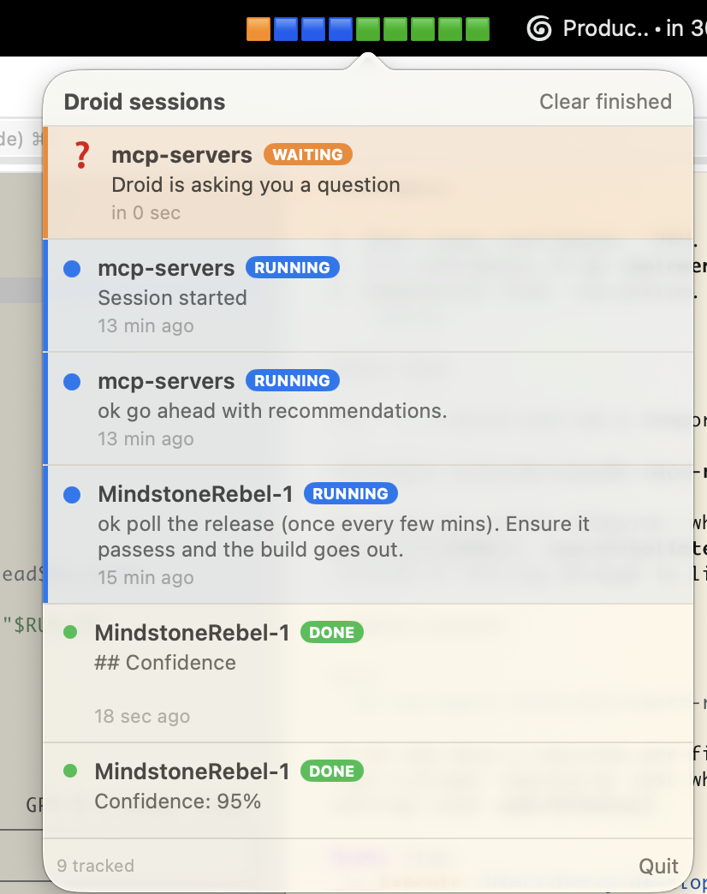

# AgentMenuBar

A macOS menu-bar app that tracks running AI-agent sessions across terminal tabs, surfaces the ones waiting for your input, and one-click-focuses the exact tab. Factory Droid, Codex CLI, and Cursor CLI (`cursor-agent`) are supported through thin hook bridges; other CLIs can plug in by normalising their hook payloads into the same socket event shape.



## Why this exists — agent overload

We started running half a dozen long-running coding agents in parallel — different repos, different tasks, all in their own iTerm tabs — and immediately hit "agent overload":

- Some are thinking, some are stuck waiting for a permission prompt or a clarifying question, some are done and idle.
- Every CLI plays the same little sound when it needs you, and none of them tell you *which* tab to look at.
- Cmd-tabbing through iTerm windows to find the one with the orange dot doesn't scale past three or four agents.

AgentMenuBar is the dashboard we wanted: at a glance, how many agents are *running*, *waiting on you*, or *finished*; one click to jump straight to the exact iTerm tab; and the menu-bar glyph flashes orange the moment anything goes from running to waiting, so you can stop watching for it.

## How it works

1. Listening to the agent CLI's documented hook events:
   - Factory Droid: `Notification`, `Stop`, `SessionStart`, `SessionEnd`, `UserPromptSubmit`, plus `PreToolUse`/`PostToolUse` for interactive `AskUser` prompts.
   - Codex CLI: `SessionStart`, `UserPromptSubmit`, `Notification`, `PermissionRequest`, `PreToolUse(request_user_input)`, `PostToolUse`, and turn-scoped `Stop`.
   - Cursor CLI (`cursor-agent`): `sessionStart`, `beforeSubmitPrompt`, `beforeShellExecution`/`beforeMCPExecution`, `afterShellExecution`/`afterMCPExecution`, `afterFileEdit`, `postToolUse`, turn-scoped `stop`, and `sessionEnd`.
2. Capturing each session's `ITERM_SESSION_ID` at start.
3. Showing one row per active agent in a popover, with click-to-focus that selects the exact iTerm window + tab.

No accessibility automation, no terminal scraping. Hooks + iTerm's own session UUID + AppleScript only.

## Supported CLIs

| Agent CLI | Hook source | Waiting signal | Done signal | Notes |
|---|---|---|---|---|
| OpenAI Codex CLI | `~/.codex/hooks.json` | `PermissionRequest`, `Notification`, and `PreToolUse(request_user_input)` | turn-scoped `Stop` | Works after reviewing/trusting the hook in `/hooks`. Tested with real Codex `UserPromptSubmit`/`PostToolUse` hooks and manual lifecycle events. |
| Factory Droid | `~/.factory/settings.json` | `Notification` and `PreToolUse` matcher `AskUser` | turn-scoped `Stop` or `SessionEnd` | Existing Droid sessions need restart after hook changes because Droid snapshots hooks at startup. |
| Cursor CLI (`cursor-agent`) | `~/.cursor/hooks.json` (shared with the Cursor IDE) | `beforeShellExecution` / `beforeMCPExecution` (command/MCP approval gate) | turn-scoped `stop` or `sessionEnd` | Install via `make install-cursor-hooks` (kept out of the default `install-hooks` because the file is shared with the IDE). Cursor has no notification/permission-request event and its `AskQuestion` picker doesn't fire tool hooks, so a clarifying question isn't observable — see Known limits. `beforeSubmitPrompt`/`stop` only fire in interactive mode, not headless `-p`. |

Both CLIs use the same socket bridge and persisted session store. CLI-specific behavior lives in `AgentEventAdapter`, so adding another agent should mean adding a thin hook wrapper plus one adapter instead of changing the UI or store shape.

For the full process, see [Adding a New CLI Agent](docs/adding-new-cli.md).

## Status

**v1.** End-to-end pipeline is implemented and smoke-tested for Factory Droid, Codex CLI, and Cursor CLI (build → install → hook event → socket → persisted row → popover state). Build is clean. The Cursor lifecycle was verified through the bridge into the running app (`sessionStart → beforeSubmitPrompt → beforeShellExecution → afterShellExecution → stop` mapping to running → running → waiting → running → finished).

## Architecture

```
 Agent hook  ──stdin JSON──▶  hooks/{factory,codex,cursor}-event-bridge.sh
                                         │
                                         │ tags agent_kind and augments with
                                         │ $ITERM_SESSION_ID, $TERM_PROGRAM, $PPID
                                         ▼
            Unix domain socket: ~/Library/Application Support/AgentMenuBar/sock
                                         │
                                         ▼
                                 AgentMenuBar.app (Swift / SwiftUI)
                                         │
                                  AppleScript│
                                         ▼
                                       iTerm2
```

- **Canonical session id**: agent-provided `session_id`.
- **Focus key**: `ITERM_SESSION_ID` captured once at `SessionStart`.
- **Storage**: `~/Library/Application Support/AgentMenuBar/sessions.json` (atomic rename).
- **Debug log**: `~/Library/Logs/AgentMenuBar/events.log` (raw augmented payloads even when the app is offline).

## Quick start

```bash
make build           # swift build (debug)
make install-hooks   # additive merge into ~/.factory/settings.json and ~/.codex/hooks.json
make run             # launches the menu bar app (no Dock icon)
```

Open a supported terminal tab and run `codex` or `droid`. You should see a row appear in the menu bar popover. When the agent asks for input or approval, the row moves to waiting; clicking the row jumps to that exact terminal tab.

For Codex CLI, open `/hooks` once after installing to review and trust the new hook definition. Codex loads hooks from `~/.codex/hooks.json`; Factory Droid loads hooks from `~/.factory/settings.json`.

To remove the hooks: `make uninstall-hooks` (your other hooks are preserved).

### Codex check

After `make install-hooks` and `/hooks` trust, start or continue a Codex session in iTerm. The app should:

- add/update a row on `UserPromptSubmit`
- turn the row orange on `PermissionRequest`, `Notification`, or Plan-mode `request_user_input`
- turn it blue again on `PostToolUse`
- mark it green on `Stop`

If Codex prints that hooks need review, open `/hooks` again; Codex records trust against the current hook definition hash, so edits require re-trust.

## Manual test (no real agent required)

```bash
make run
# in another terminal, inside iTerm:
make test-event   # runs scripts/send-test-event.sh: SessionStart, UserPromptSubmit, Notification, Stop
```

You'll see four notifications and one row in the popover, ending in "Finished task".

## Status states

| State | Colour | When |
|---|---|---|
| running | blue | After `SessionStart`/`sessionStart`, a prompt submit, or any tool/file/shell activity |
| waitingForInput | orange | On Factory `Notification`, Factory `AskUser`, Codex `PermissionRequest`, Codex `Notification`, Codex Plan-mode `request_user_input`, or Cursor `beforeShellExecution`/`beforeMCPExecution` |
| finished | green | After `Stop`/`stop` or `SessionEnd`/`sessionEnd` |
| stale | grey | A previously-running session whose process disappeared |

The menu bar icon is grey when nothing's tracked, shows a count when sessions are active, and turns orange with an alert glyph when at least one session is `waitingForInput`.

## Known limits (by design in v1)

- macOS only (built for macOS 13+; tested on 26).
- iTerm only — sessions started outside iTerm appear in the list but can't be focused.
- Factory Droid, Codex CLI, and Cursor CLI only. Other CLIs need a hook wrapper and an `AgentEventAdapter`.
- Cursor CLI waiting-state is approximate. `cursor-agent` exposes no notification/permission-request event, and its interactive `AskQuestion` picker doesn't fire tool hooks, so the only hook-observable "needs you" moment is a shell/MCP approval gate (`beforeShellExecution`/`beforeMCPExecution`). With auto-run enabled this shows as a brief orange flicker rather than a sustained wait; a clarifying question won't turn the row orange at all. The `~/.cursor/hooks.json` file is shared with the Cursor IDE, so installing also tracks IDE agent sessions (which appear as unfocusable rows since they aren't bound to a terminal tab).
- No accessibility / screen-scraping.
- Notifications are emitted via `osascript display notification` (so they appear under "Script Editor" in the system notification source). This is deliberate — it avoids needing a signed bundle for `UNUserNotificationCenter`.

## Requirements

- macOS 13+ (Ventura) — tested on 26 (Tahoe)
- Xcode CLT / Swift 5.9+
- iTerm2
- `jq`, `nc`, `osascript` (all preinstalled on macOS)

## Layout

```
docs/
  adding-new-cli.md                   integration runbook for future CLI agents
  popover.png                         screenshot used above
hooks/
  agent-event-bridge.sh               shared hook bridge: tag agent + forward to socket
  factory-event-bridge.sh             shell that Factory invokes
  codex-event-bridge.sh               shell that Codex invokes
  cursor-event-bridge.sh              shell that Cursor invokes (normalises conversation_id/workspace_roots)
  settings-hooks-block.json           Factory reference snippet
  codex-hooks-block.json              Codex reference snippet
  cursor-hooks-block.json             Cursor reference snippet
scripts/
  send-test-event.sh                  fake-event harness for development
Sources/AgentMenuBar/
  App/AgentMenuBarApp.swift           @main, MenuBarExtra, accessory policy, server boot
  Domain/                             DroidSession, AgentKind, AgentEventAdapter,
                                      HookEvent, SessionStatus,
                                      RepoInfo, TranscriptReader
  Store/                              SessionStore (state machine) + JSON persistence
  IPC/                                BSD UDS server + JSON decoder
  Focus/ITermFocuser.swift            AppleScript focus by iTerm session UUID
  UI/                                 MenuBarLabel, popover list, row
  Notifications/                      osascript-based notifier
```

## Make targets

| Target | What it does |
|---|---|
| `make build` | swift build (debug) |
| `make release` | swift build -c release |
| `make run` | build + launch (debug) |
| `make run-release` | build + launch (release) |
| `make stop` | kill any running AgentMenuBar |
| `make install-hooks` | additive jq merge into Factory and Codex hook settings, backup first |
| `make uninstall-hooks` | inverse, prunes empty groups, backup first |
| `make install-factory-hooks` | additive jq merge into `~/.factory/settings.json`, backup first |
| `make install-codex-hooks` | additive jq merge into `~/.codex/hooks.json`, backup first |
| `make install-cursor-hooks` | additive jq merge into `~/.cursor/hooks.json` (shared with the IDE), backup first |
| `make uninstall-cursor-hooks` | inverse for Cursor, prunes empty groups, backup first |
| `make test-event` | send the demo event sequence to the running app |
| `make tail-events` | tail `~/Library/Logs/AgentMenuBar/events.log` |
| `make clean` | swift package clean |

## Roadmap (post-v1)

- Proper `.app` bundle for Login Items and signed `UNUserNotificationCenter` notifications.
- "Snooze attention" / per-session mute.
- Other terminals: Terminal.app, Warp, Ghostty (via per-terminal focuser adapters).
- Generic agent providers (Claude Code, …) once their hook surfaces stabilise. Cursor CLI is supported as of this version; a dedicated waiting/permission event would let us drop the `beforeShellExecution` approximation.

## License

[Functional Source License, Version 1.1, MIT Future License](LICENSE) (FSL-1.1-MIT) — copyright © 2026 Mindstone Learning Limited. You can use, modify, and redistribute the Software for any purpose other than offering it as a competing commercial hosted service. The license auto-converts to plain MIT on **2030-05-20**.
